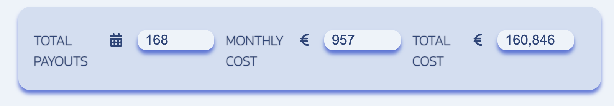
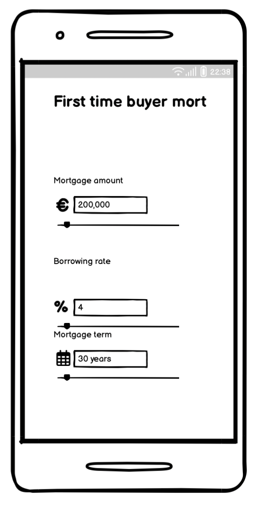

# Mortgage Calculator for Home Buyers in Ireland

[Live Tool](https://oarina.github.io/mortgage-calculator/) — Estimate your mortgage repayments with an interactive, mobile-friendly calculator tailored for Irish home buyers.

**Note:** This tool provides general repayment estimates and does not distinguish between fixed or variable interest rate products.

---

## Why This Calculator?

Most mortgage tools online are offered by lenders and tailored to their terms. This calculator was independently built to help first-time buyers explore a broader range of mortgage scenarios—including high-interest edge cases—so they can plan more confidently.

Mortgage terms often span 20–35 years. Over this time, central bank rates can fluctuate significantly. For example, Irish mortgage rates peaked at 16% during the 1980s ([source](https://www.moneyguideireland.com/history-of-mortgage-rates-in-ireland.html)). While extreme, it’s a reminder of why borrowers may wish to model worst-case scenarios alongside best-case outcomes.

---

## Table of Contents

- [User Experience](#user-experience)
  - [Target Users](#target-users)
  - [User Goals](#user-goals)
  - [User Stories](#user-stories)
- [Features](#features)
  - [Interactive Input Sliders](#interactive-input-sliders)
  - [Live Repayment Output](#live-repayment-output)
  - [Calculation Logic](#calculation-logic)
- [Design & Wireframes](#design--wireframes)
- [Technical Stack](#technical-stack)
  - [Deployment](#deployment)
  - [Tech Used](#tech-used)
  - [Testing](#testing)
  - [Known Issues](#known-issues)
- [Credits](#credits)

---

## User Experience

### Target Users

- First-time home buyers in Ireland exploring repayment scenarios.
- Users comparing multiple quotes or mortgage types (e.g., fixed vs variable).
- Buyers planning for long-term financial impact.

### User Goals

- Run quick, mobile-friendly repayment estimates.
- Model edge-case events (e.g., rate hikes).
- Compare amortisation outcomes across terms and borrowing rates.

### User Stories

- “I want to estimate repayments with a 3% interest rate vs 6%.”
- “I heard rates were 16% in the 1980s. What would that mean today?”
- “I’m using the Help to Buy scheme and want to model the smallest and largest loan sizes allowed.”
- “I’ve been quoted 5% and 3.5%—how much would I save with the lower rate?”
- “I’m a realtor giving clients a quick breakdown on my phone.”

---

## Features

### Interactive Input Sliders

- Predefined ranges reflect realistic mortgage conditions in Ireland:
  - Term: 5–35 years
  - Amount: €25,000–€1,000,000 (editable beyond)
  - Rate: 0%–20%, to cover potential future rate spikes or dips
- Inputs trigger live recalculations so users instantly see results.
- Edge-case warnings are shown if sliders exceed configured thresholds.

  
  

---

### Live Repayment Output

- Clean, accessible display showing:
  - Monthly repayment estimate
  - Total repayment amount
  - Total interest paid over the term

---

### Calculation Logic

- Based on [Investopedia’s Amortisation Formula](https://www.investopedia.com/terms/a/amortization.asp), implemented in JavaScript.
- Calculates repayment using:
  - Initial mortgage amount
  - Interest rate
  - Term (in months)
- Output updates in real time with each input change.

---

## Design & Wireframes

### Full-Screen and Mobile Designs

  

### Colour Palette

---

## Technical Stack

### Deployment

Hosted on GitHub Pages.

Steps:
1. In GitHub repo, go to **Settings > Pages**.
2. Select the **Main branch** as source.
3. The project will be deployed under GitHub Pages.

[Live Link](https://oarina.github.io/mortgage-calculator/)

---

### Tech Used

- **Languages:** HTML, CSS, JavaScript
- **Editor Extensions:** Prettier (VS Code)
- **Libraries:** FontAwesome, Google Fonts
- **IDEs/Platforms:** VS Code (cloud and local), CodeAnywhere

---

### Testing

- Google Lighthouse (Performance & Accessibility)  
  
- W3C CSS Validation: No errors  
- Nu HTML Checker: No errors  
- JSHint:
  - Some unused variable warnings—intended due to linked DOM variables.
  - ES6 compatibility noted and expected.

Tested on multiple screen sizes including mobile.

---

### Known Issues

- Slider functionality can be limited on some Apple mobile devices.

---

## Credits

- Inspired by open-source best practices and YouTube dev channels like [Coding Tech](https://www.youtube.com/watch?v=ezhugY8TJDU) (for Prettier setup).
- Icons via FontAwesome.

---

  

