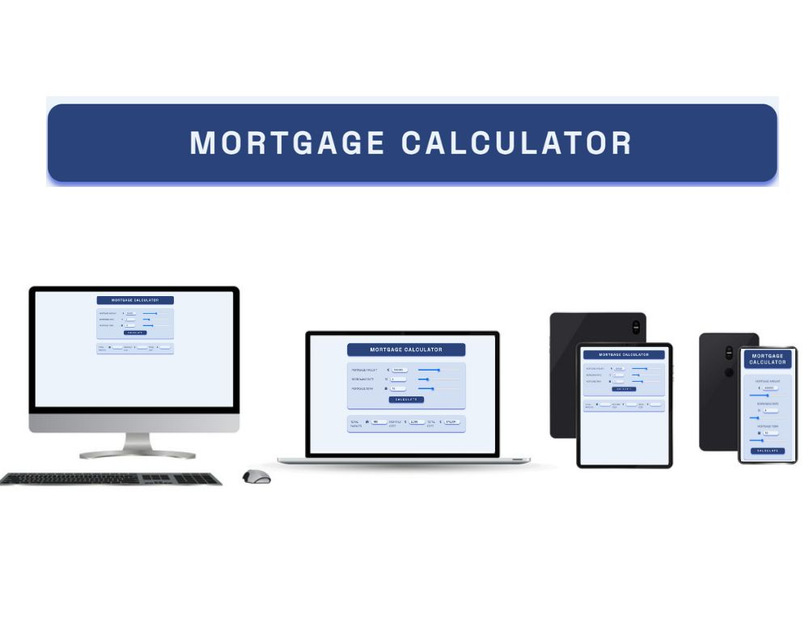
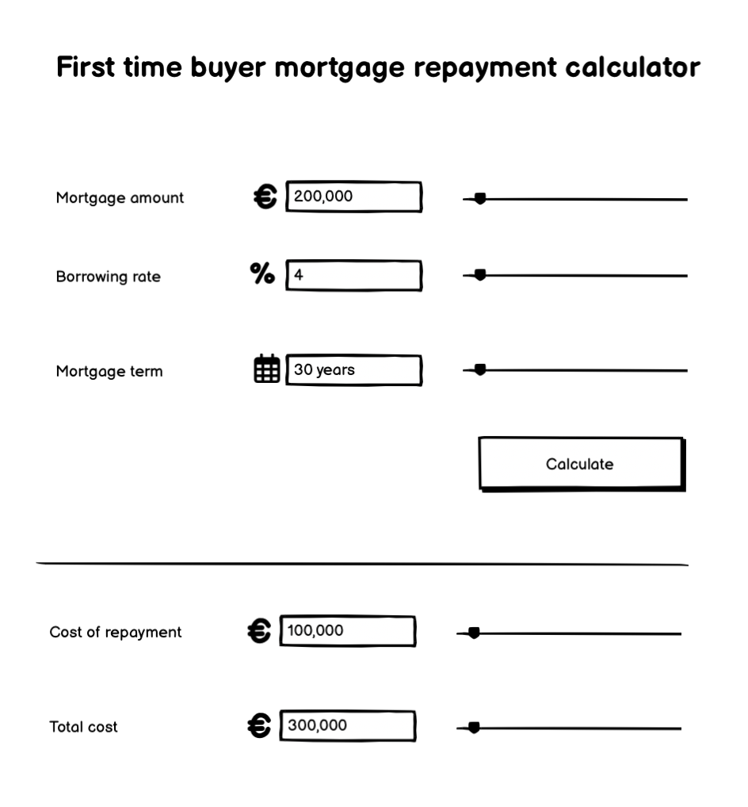
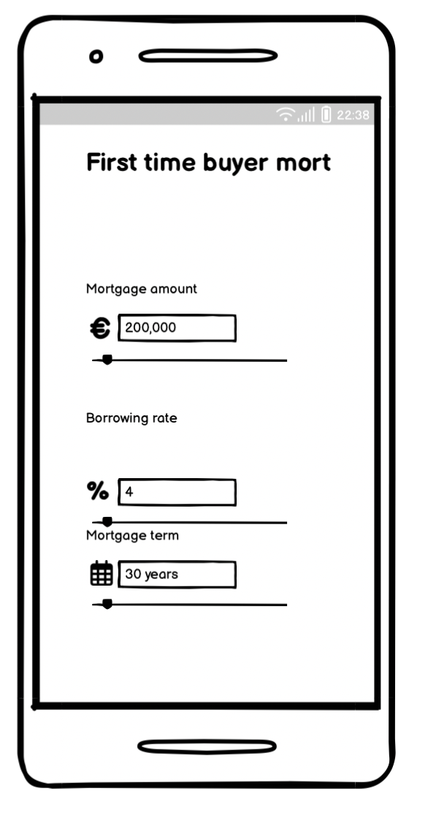
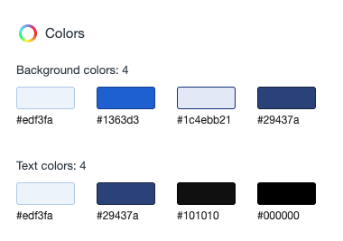
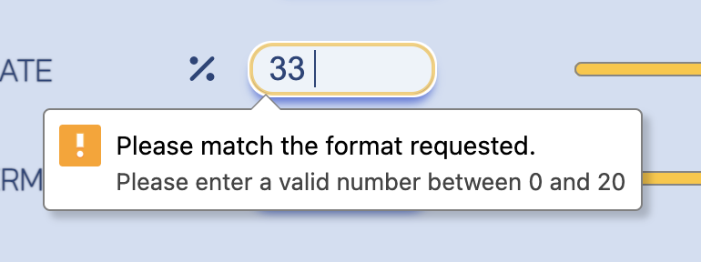
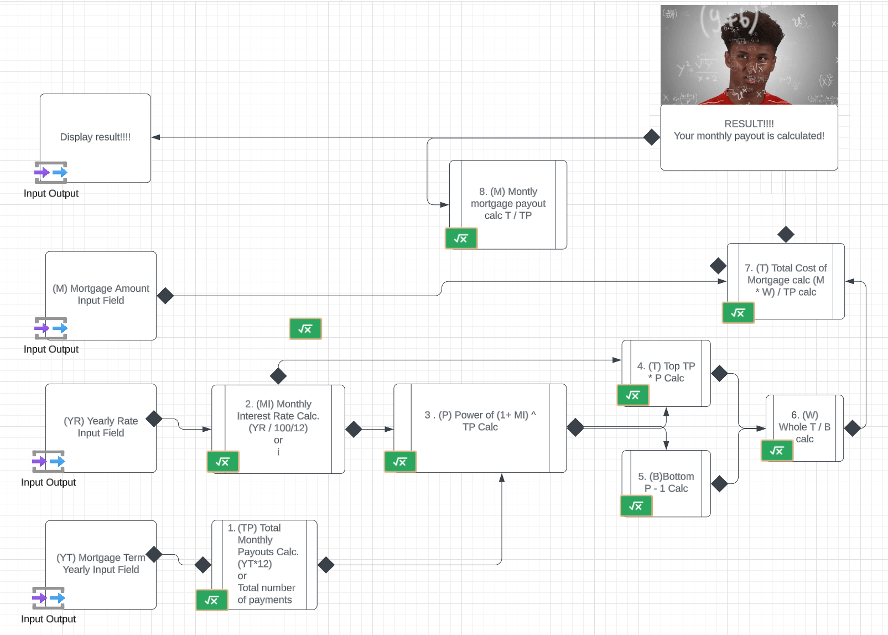

# Mortgage Calculator for home buyers in Ireland.

[Mortgage Calculator](https://oarina.github.io/mortgage-calculator/) This calculator intended to be an estimate of a repayment taking into account the borrowing rate.

NOTE: It does not take into consideration the differences between variable or fixrd term rates. 

***

Morgage estimators online are provided mostly by the lending institutions themselves.

It's hard to know what mortgage rates would be like after the fixed rate term is over or unknow if ECB will hike rates once more or lower them. 

Especially if your mortgage is 30 years it would be good to estimate the the payback rate so that one may be prepared better for more scenarios. 

Back in 1980's in Ireland the interest rates went up to 16% due to inflation, as per [moneyireland.ie](https://www.moneyguideireland.com/history-of-mortgage-rates-in-ireland.html)  Most likely this will not happen in the next 20 to 30 years, but in the rare chance - why not make a rought estimate? 

# Table of Contents
- [UX](#ux)
  - [First-time home buyer Goals](#first-time-home-buyer-goals)
    - [Target users](#target-users)
    - [User Goals](#user-goals)
  - [User Stories](#user-stories)
  - [Visual Design](#visual-design)
    - [Wireframes](#wireframes)
    - [Styling](#styling)
- [Features](#features)
  - [Input section with a slider](#input-section-with-a-slider)
  - [Output section (result section)](#output-section-result-section)
  - [Calculator](#calculator)
- [Tech](#tech)
  - [Deployment](#deployment)
  - [Technologies Used](#technologies-used)
  - [Libraries](#libraries)
  - [Platforms](#platforms)
  - [Testing](#testing)
  - [Bugs](#bugs)
- [Credits](#credits)

# UX
## First-time home buyer Goals 

### Target users 

* Anyone in Ireland who is considering buying their first home and have already been to a bank's and are looking to estimate a good deal factoring in potential rise in interest rates as per ECB. 

*  Someone who is on the move and wants a very quick calculation.

### User Goals 

- Quick estimate slider
- Black swan event calculation 
- Best case scenario calcuation for the market

## User Stories

 * Someone who wants to become aware of any government scheme to help get onto the property ladder.

 * Someone who may be looking to take on a longterm mortage - e.g. 35 years

 * Someone who wants to get a mortgage for a short time and pay off as soon as possible

 * Someone who is not sure what kind of mortage is best and got a few  quotes (fixed and variable) and want to find out which one is best.

 * Someone who wants to consider best and worst case scenario.

 * Realtor- who already has actual rate 

## Visual Design

### Wireframes

* Full screen wireframe

* Mobile screen wireframe

### Styling 

# Features

## Input section with a slider
* Sliders are preset to a maximum and a minimum limits that are currently available for home buyers in Ireland. For example a minimum mortgage term is 5 years and 35 is the maximum. €25,000 is also a minimum one could get for a mortgage in Ireland. I have set a maximum to  €1,000,000, however for the lucky few they can exhaust adding up 7 digits into the mortgage amount section and get a quick calculation.
* The slider movement will trigger a re-calculation so  a user can see the updated amount on the fly.
* Another great thing here is that you can calculate the borrowing rate from an actual zero to 20%. This would appeal to a user who may take out a long term mortgage and are looking to estimate a potential rise or fall in the amount provided there is an unforseen event, as in 1980's the mortgage rate came to 16% and in Japan the government brought the borrowing rate close to a zero in order to stimulate the economy. The reason the rate is maximum 20% is because we had a rate of 16% in the past, US had a maximum in that area also, so I have rounded this number up to 20.
* You will be given a warning should you go above or under the accepted values

## Output section (result section )
* The result section is where you can ge the quick result to your calcullation. 

## Calculator
* I have taken the [Investopedia Amortiataion formula](https://www.investopedia.com/terms/a/amortization.asp#:~:text=This%20is%20often%20calculated%20as,multiplied%20by%20the%20beginning%20balance.) and broken it down into JavaScript readable steps. It calculates from the initial amount, rate and a term wich them outputs a result for total payouts, total mortgage amount and a monthly payout according to the settings. 

* Want to have a range bar that slides to change the number in the form easily.

# Tech 

## Deployment

This is a GitHub pages deploment. Please follow these stepps to deploy this project:
* Navigate to settings tab in the Github repositiry and in the source section selet the Main Branch in the menu which will give you a link to the completed website. 
* Here is the live link: [Mortgage Calculator](https://oarina.github.io/mortgage-calculator/)

##  Technologies Used 
* HTL 
* CSS 
* JavaScript
* Prettier extension in VSCode

## Libraries
* fontawesome
* Google Font

## Platforms 
* Codeanywhere 
* VS Code both native and cloud

## Testing 

* Ran a Lighthouse report from Google Dev Tools 
* Ran the site through the [The W3C CSS Validation Service](https://jigsaw.w3.org/css-validator/validator?uri=https%3A%2F%2Foarina.github.io%2Fmortgage-calculator%2F&profile=css3svg&usermedium=all&warning=1&vextwarning=&lang=en) - no errors
* Ran the site through the [Nu Html Checker](https://validator.w3.org/nu/?doc=https%3A%2F%2Foarina.github.io%2Fmortgage-calculator%2F) - no errors
* Ran the site through the [Jshint](https://jshint.com/) - note that there is a warning about unused variables. I left that as is as the variables are actually attached to the HTML document. It also gave me a warning "'let' is available in ES6 (use 'esversion: 6') or Mozilla JS extensions (use moz)".
    * There are 7 functions in this file. Function with the largest signature take 1 arguments, while the median is 1. Largest function has 34 statements in it, while the median is 1. The most complex function has a cyclomatic complexity value of 2 while the median is 1.
* Tested site in different devices.

## Bugs
* Apple mobile devices that this site was tested on had unresponsive sliders.
* Click on the three dots at the top right in the [Github Repository](https://github.com/oarina/mortgage-calculator)

### Credits

* VSCode Extensions from Coding Tech YouTube channel https://www.youtube.com/watch?v=ezhugY8TJDU that inspired me to use Prettier VSCode extension. 

<!--Granted logo from CSS validator-->

    

